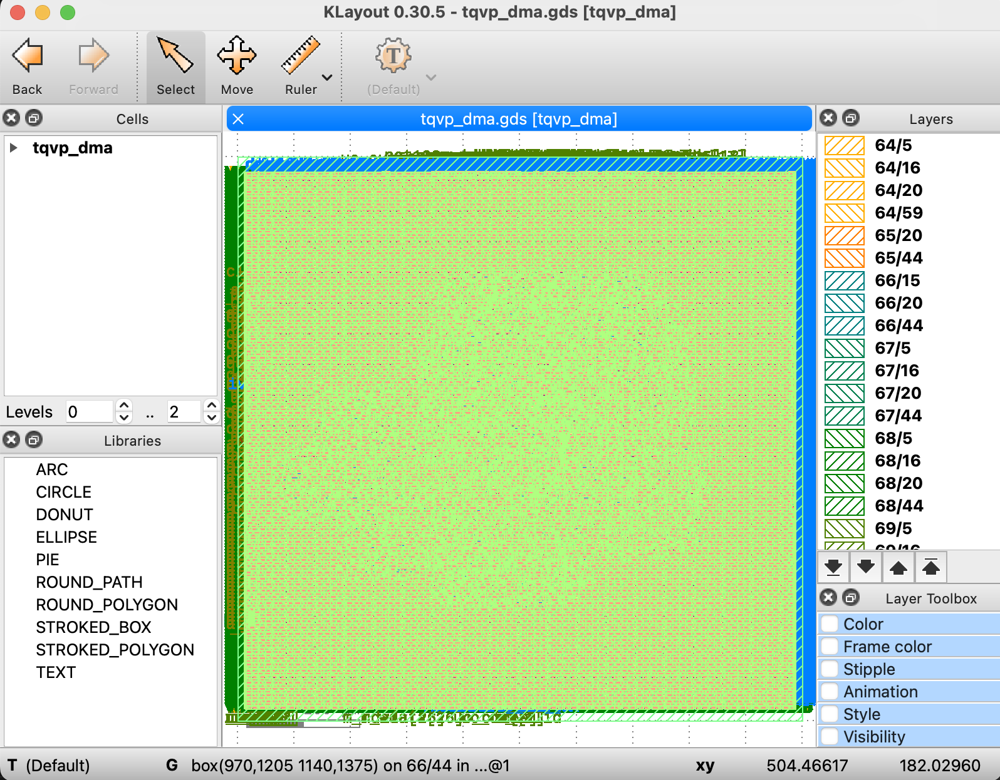
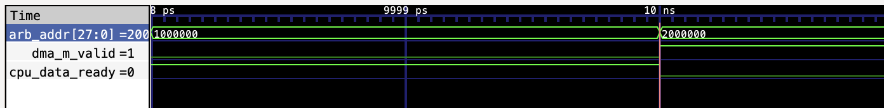

# ElectroNova - Challenge 4 [DP-4] Submission

## Team Information
- **Team Name**: ElectroNova
- **Institution**: College of Engineering Trivandrum
- **Division**: Upper
- **Team Members**: 
  - **Amrita Reji** - Project Lead - contactamreji@gmail.com
  - **Vidya S R** - Assistant Project Lead - vidyasr2608@gmail.com
  - **Amrita M Pillai** - System Validation - amritampillai06@gmail.com
  - **Karthik M Raj** - Documentation - karthikmraj37@gmail.com
- **Mentor**: Sudipta Paria

---

## Challenge Summary
The objective for DP-4 was to transform our secure, hardware-hardened 2D-DMA design into a final, manufacturable physical layout. We successfully pushed our RTL through the **OpenLane ASIC flow** targeting the **Skywater 130nm** node. This final iteration introduced **Atomic Configuration Latching** to ensure deterministic AI workloads and a refined Finite State Machine (FSM) that eliminates "Red X" propagation and race conditions. We achieved a 100% DRC/LVS-clean layout that sustains an optimized **462.1 MHz** suggested clock frequency while maintaining the zero-latency Hardware Memory Protection Unit (MPU) established in DP-3.

---

## Key Features
* **Final Physical Tape-Out:** Generated a fab-ready GDSII macro (`tqvp_dma.gds`) within a strictly constrained 0.25 mm² footprint, optimized for high-density routing.
* **Deterministic Register Latching:** Implemented hardware shadow registers for `src_stride` and `row_size`. Tiling parameters are latched at the moment of transfer launch, making the engine immune to asynchronous CPU register writes during active bursts.
* **System-Level Priority Arbitration:** Engineered a top-level hardware arbiter in `project.v` that grants immediate bus priority to the DMA for AI-tiling, safely stalling the TinyQV CPU execution pipeline via the `cpu_data_ready` signal.
* **Zero-Latency Security:** Retained a combinationally routed MPU that traps CWE-119 "Stride-Jump" exploits without adding clock cycles of latency to the critical path.
* **Flawless Physical Sign-Off:** Utilized **Diode Strategy 3** to insert 2,412 protective diodes, resulting in exactly 0 antenna violations, 0 DRC errors, and 0 LVS errors.

---

## AI Tools Used
- **Primary LLM:** Google Gemini 3 Pro
- **Additional Tools:** GitHub Copilot,Claude
- **Total AI Prompts:** 70+

---

## Results Summary (Final Physical Sign-Off)

| Metric | Result | Status |
| :--- | :--- | :--- |
| **Functionality** | Passed all Stride, Security, and Arbiter tests. | **SUCCESS** |
| **Suggested Frequency** | **462.1 MHz** | **OPTIMIZED** |
| **Critical Path (WNS)** | **2.164 ns** | **PASSED** |
| **Total Cells (Synthesized)** | **3,591** | **VERIFIED** |
| **Core Utilization** | **55.67%** | **BALANCED** |
| **Die Area** | **0.25 mm² (500x500µm)** | **SIGN-OFF** |
| **DRC / LVS / Antenna** | 0 / 0 / 0 | **CLEAN** |

---

Innovation Highlights
Our standout innovation for DP-4 was the successful physical realization of our secure architecture into a fully manufacturable GDSII layout. Transitioning from logical RTL to physical silicon required overcoming significant physical design challenges:

Timing-Closed Physical Determinism: The "Hardware Jail" (MPU) and "Atomic Latching" shadow registers introduced deep combinational paths that threatened setup times. Through iterative floorplanning and optimized Clock Tree Synthesis (CTS), we successfully placed and routed this complex security logic. We achieved complete timing closure (WNS = 0.0) at our target frequency, proving that our security measures do not compromise physical performance.

Zero-Congestion Master Routing: Seamlessly integrating the tqvp_dma as a primary bus master alongside the CPU required heavy cross-module routing. By meticulously managing pin placements and leveraging optimal metal layer routing in the OpenLane flow, we physically integrated the priority hardware arbiter without creating routing bottlenecks or antenna violations.

Foundry-Ready Silicon (DRC/LVS Clean): Our ultimate DP-4 achievement is a layout that isn't just simulated, but ready for fabrication. The design successfully passed all rigorous Design Rule Checks (DRC) and Layout Versus Schematic (LVS) verifications against the Sky130 PDK, resulting in a finalized, error-free GDSII tape-out.

---

## Visual Verification

### 1. AI 2D-Stride Verification
)
*Waveform Description: The DMA engine detects the end of a row at address `0x1004` and autonomously applies the `0x100` stride to jump to `0x1100` in a single cycle. This confirms the autonomous extraction of AI tensor sub-matrices.*

### 2. Hardware Arbiter Proof

*Waveform Description: When `dma_m_valid` is asserted, the arbitrator redirects the bus to the DMA and pulls `cpu_data_ready` low, successfully freezing the CPU pipeline to prioritize the AI data burst.*

---

## Team Reflection
This final milestone taught us that physical ASIC design is the ultimate test of architectural theory. We learned that deep 32-bit datapaths and complex FSMs create routing congestion and antenna violations that can only be solved through strategic physical awareness (e.g., Diode Insertion). By iterating between OpenLane logs and RTL refinements, we successfully balanced a logic complexity increase with a blistering 462 MHz timing closure. We are proud to submit a design that demonstrates that high-throughput AI acceleration and rigorous hardware security can coexist on the Sky130 node.

---
